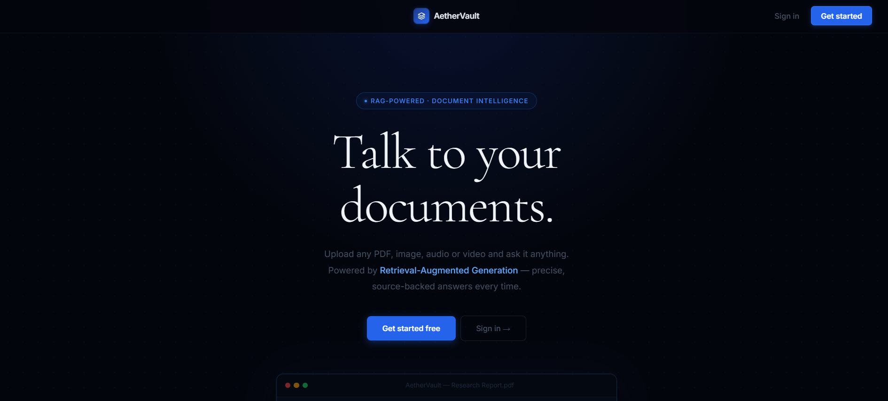
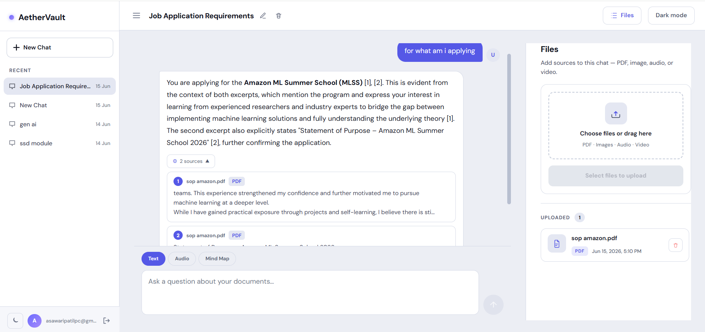
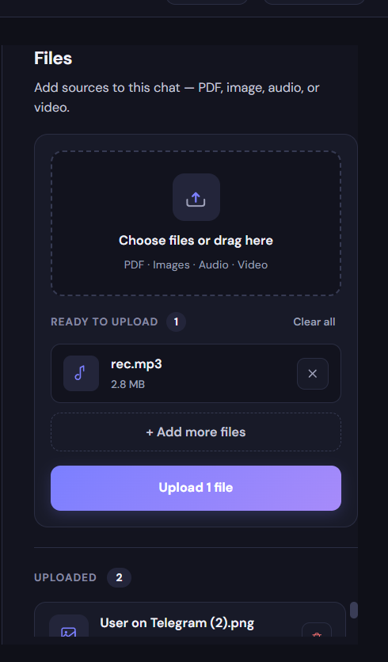
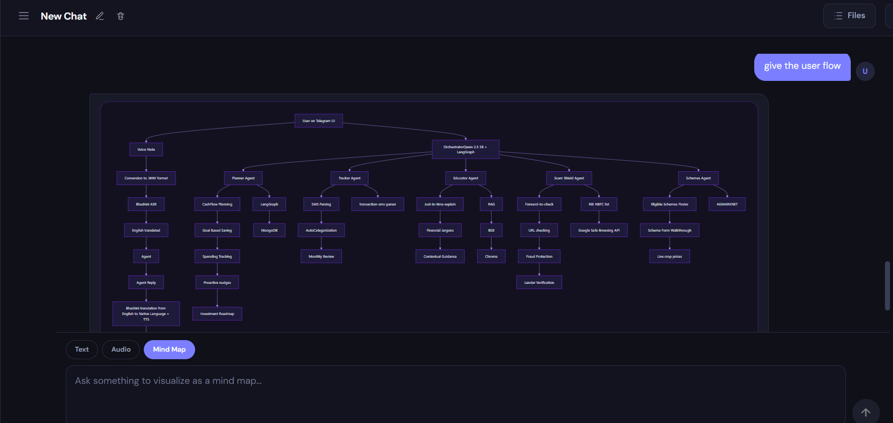

# AetherVault

Talk to your documents. AetherVault is a RAG-powered document intelligence platform that lets you upload files, ask questions in natural language, and get cited, streaming answers grounded in your own content.

---

## Screenshots

> To add screenshots: take them while the app is running, save them in a `screenshots/` folder in the project root, then commit and push. They will appear here automatically on GitHub.

**Landing page**


**Chat with cited answer**


**Live upload pipeline**


**Mind map mode**


---

## What makes this different from a basic RAG app

Most RAG tutorials do: embed document → vector search → send to LLM. AetherVault goes further:

- **Hybrid search with RRF** — combines vector search (semantic meaning) and full-text search (keyword accuracy) using Reciprocal Rank Fusion. A question like "what is Form 10-K section 7A?" gets the exact match from text search and the semantic context from vector search, merged into one ranked result.
- **Smart PDF parsing** — PyMuPDF for fast text extraction, with automatic fallback to Docling when a PDF is scanned or image-heavy (detected by characters-per-page threshold).
- **Multimodal ingestion** — the same pipeline handles PDFs, images (Google Cloud Vision OCR), audio (Whisper transcription via ffmpeg), and video in one unified flow.
- **Three answer modes** — text with streaming citations, audio playback with language detection, and Mermaid mind maps generated from document content.
- **Rate limit resilience** — if the primary LLM (`llama-3.3-70b-versatile`) hits its daily quota, the app transparently retries with `llama-3.1-8b-instant` without interrupting the user.
- **Live ETL progress** — upload progress is streamed to the frontend via SSE so users see parse → chunk → embed → store in real time, not a spinner.

---

## What it does

- Upload PDFs, images, audio, or video files into a chat session
- Ask questions and get real-time streaming answers with inline citations like `[1]`, `[2]`
- Switch between three answer modes: **Text**, **Audio**, or **Mind Map**
- Every answer is sourced strictly from your documents — no hallucination, no guessing

---

## Architecture

```
┌─────────────────────────────────────────────────────────────┐
│                        UPLOAD FLOW                          │
│                                                             │
│  File → S3 → Parse → Chunk → Embed (Python) → MongoDB      │
│          ↓       ↓                                          │
│        PDF     Image   Audio   Video                        │
│      PyMuPDF  GCloud  Whisper Whisper                       │
│      Docling   Vision  +ffmpeg +ffmpeg                      │
└─────────────────────────────────────────────────────────────┘

┌─────────────────────────────────────────────────────────────┐
│                         QUERY FLOW                          │
│                                                             │
│  Question → Embed (Python)                                  │
│                ↓                                            │
│         ┌──────┴──────┐                                     │
│    Vector Search   Text Search    (run in parallel)         │
│    (semantic)      (keyword)                                │
│         └──────┬──────┘                                     │
│                ↓                                            │
│        RRF Fusion + Score Filter                            │
│                ↓                                            │
│     Top Chunks + Redis History → Groq LLM → SSE Stream     │
│                                      ↓                      │
│                            Answer + Citations [1][2]        │
└─────────────────────────────────────────────────────────────┘
```

---

## Tech Stack

| Layer | Technology |
|---|---|
| Frontend | React 19, Vite 8, Tailwind CSS 4, React Router 7, Mermaid.js |
| Backend | Node.js, Express 5 (ES Modules) |
| Database | MongoDB Atlas — Vector Search + Full-Text Search |
| Auth | Supabase Auth (JWT) |
| File Storage | AWS S3 (presigned URLs for secure retrieval) |
| Embeddings | Python Flask microservice — `BAAI/bge-base-en` via sentence-transformers |
| LLM | Groq API — `llama-3.3-70b-versatile` (primary), `llama-3.1-8b-instant` (fallback + diagrams) |
| PDF Parsing | PyMuPDF (fast path) → Docling (fallback for scanned/image-heavy PDFs) |
| Audio/Video | OpenAI Whisper via Python + ffmpeg for format conversion |
| Image OCR | Google Cloud Vision API |
| Chat Memory | Redis (Upstash) for per-session message history |

---

## Project Structure

```
AetherVault/
├── screenshots/                 # Add screenshots here
├── frontend/                    # React + Vite app
│   └── src/
│       ├── pages/
│       │   ├── Landing.jsx      # Public landing page
│       │   ├── Login.jsx
│       │   ├── Signup.jsx
│       │   └── Dashboard.jsx    # Main chat interface
│       └── components/
│           ├── ChatFilesPanel.jsx   # Document sidebar + upload pipeline
│           └── ChatQueryPanel.jsx   # Query input, SSE streaming, answer modes
│
└── backend/                     # Express API
    ├── server.js
    ├── embedding_server.py      # Python Flask — embeddings + PDF parsing
    ├── whisper.py               # Whisper transcription helper
    ├── controllers/
    │   ├── uploadController.js  # ETL pipeline with SSE progress events
    │   ├── askController.js     # RAG query + answer streaming
    │   └── chatController.js   # Chat/document CRUD
    ├── services/
    │   ├── ai/groqService.js    # LLM streaming, diagram gen, title gen
    │   ├── parsers/             # PDF, image, audio, video parsers
    │   ├── etl/                 # Chunker + embedding service
    │   ├── searchService.js     # Hybrid search with RRF fusion
    │   └── historyService.js    # Redis chat history (sliding window)
    ├── models/                  # Mongoose schemas
    ├── middleware/auth.js       # Supabase JWT verification
    └── utils/
```

---

## How it works

### 1. Upload → ETL Pipeline

When you upload a file, the backend runs a 4-step pipeline and streams live progress to the frontend via SSE:

```
Upload → Parse → Chunk → Embed → Store in MongoDB
```

- **Parse**: Routes to the correct parser by file type
  - PDF: PyMuPDF (fast) → Docling fallback if the PDF is scanned/image-heavy
  - Image: Google Cloud Vision (OCR)
  - Audio/Video: ffmpeg converts to WAV → OpenAI Whisper transcribes
- **Chunk**: Structure-aware splitting for PDFs with markdown headers, fixed-size overlap for everything else
- **Embed**: Batched through the Python Flask embedding server (`BAAI/bge-base-en`, 768 dimensions)
- **Store**: Chunks + embeddings + metadata saved to MongoDB Atlas

### 2. Ask → Hybrid RAG

1. Query is embedded by the same Python service
2. **Vector search** (`$vectorSearch`) and **full-text search** (`$search`) run in parallel on MongoDB Atlas
3. Results are merged with **Reciprocal Rank Fusion (RRF)** — chunks ranked low by both searches are filtered out
4. Top chunks + last 5 turns from Redis are sent to Groq LLM
5. Answer streams back token-by-token via SSE with `[1]`, `[2]` inline citations
6. Sources payload is sent in the final SSE event

### 3. Answer Modes

| Mode | Description |
|---|---|
| Text | Streamed markdown answer with inline citations |
| Audio | Same pipeline + Web Speech API playback with language detection |
| Mind Map | Groq generates a Mermaid `graph TD` diagram from document content |

### 4. Rate Limit Fallback

If `llama-3.3-70b-versatile` hits Groq's daily token limit (HTTP 429), `streamAnswer` automatically retries with `llama-3.1-8b-instant` — same prompt, no error shown to the user.

---

## Getting Started

### Prerequisites

- Node.js 18+
- Python 3.10+ with conda or venv
- MongoDB Atlas cluster with Vector Search + Atlas Search indexes configured
- AWS S3 bucket
- Supabase project (for auth)
- Groq API key
- Google Cloud Vision credentials

### Environment Variables

Create `.env` in `/backend`:

```env
PORT=5000
MONGODB_URI=your_mongodb_uri

GROQ_API_KEY=your_groq_key

AWS_REGION=your_region
AWS_ACCESS_KEY=your_access_key
AWS_SECRET_KEY=your_secret_key
AWS_BUCKET_NAME=your_bucket_name

SUPABASE_URL=your_supabase_url
SUPABASE_SERVICE_KEY=your_supabase_service_key

EMBEDDING_SERVER_URL=http://localhost:5002
WHISPER_PYTHON_PATH=python

ATLAS_VECTOR_INDEX=chunks_hybrid
ATLAS_TEXT_INDEX=chunks_text
```

Create `.env` in `/frontend`:

```env
VITE_SUPABASE_URL=your_supabase_url
VITE_SUPABASE_ANON_KEY=your_supabase_anon_key
VITE_API_URL=http://localhost:5000
```

### Running the app

**1. Start the Python embedding server**
```bash
cd backend
pip install flask sentence-transformers pymupdf docling requests
python embedding_server.py
```

**2. Start the backend**
```bash
cd backend
npm install
npm run dev
```

**3. Start the frontend**
```bash
cd frontend
npm install
npm run dev
```

App runs at `http://localhost:5173`.

---

## MongoDB Atlas Index Setup

**Vector Search Index** (`chunks_hybrid`):
```json
{
  "fields": [
    { "type": "vector", "path": "embedding", "numDimensions": 768, "similarity": "cosine" },
    { "type": "filter", "path": "userId" },
    { "type": "filter", "path": "chatId" },
    { "type": "filter", "path": "metadata.sourceType" }
  ]
}
```

**Full-Text Search Index** (`chunks_text`):
```json
{
  "mappings": {
    "fields": {
      "text": [{ "type": "string" }],
      "userId": [{ "type": "token" }],
      "chatId": [{ "type": "token" }],
      "metadata": {
        "fields": { "sourceType": [{ "type": "token" }] }
      }
    }
  }
}
```
